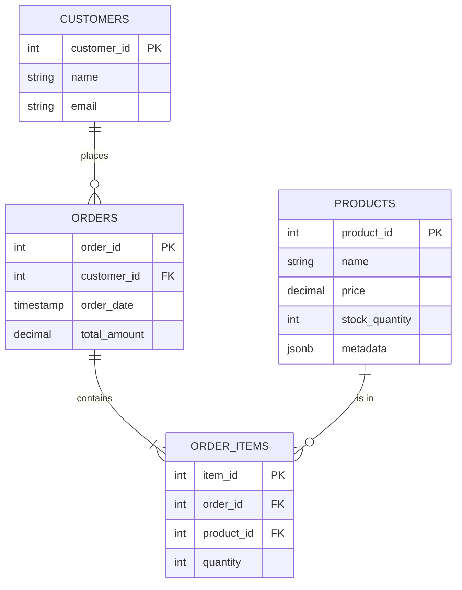

# E-Commerce Analytics Data Pipeline (Databases Module Lab 1)

## Overview
This project implements a scalable e-commerce backend with:
- **PostgreSQL** for transactional data (Orders, Products, Customers).
- **Redis** for caching top-selling products.
- **MongoDB** to store and retrieve unstructured user session data, such as the contents of a shopping cart.

## Setup
1. **Prerequisites**: Docker Desktop, Python 3.11+
2. **Install Dependencies**:
   ```bash
   poetry install
   # OR
   pip install -r requirements.txt
   ```
3. **Start Services**:
   ```bash
   docker compose up -d
   ```
4. **Run Pipeline**:
   ```bash
   # This script will seed data, run logic, and show analytics
   poetry run python -m e_commerce_analytics_data_pipeline.main
   ```

## Database Design (3NF)
### Entity-Relationship Diagram


## Design Decisions
- **Normalization**: Schema is in 3NF to reduce redundancy.
- **Polyglot Persistence**:
  - `JSONB` in Postgres for purely product attributes (size, color) allows flexibility without altering schema.
  - `Redis` prevents hitting the DB for frequently accessed "Top Products".
  - `MongoDB` handles caching shopping carts without easier scaling.
- **Transactions**: `create_order` uses `SELECT ... FOR UPDATE` to lock product rows, ensuring stock isn't oversold (Race Condition handling).

## Performance Optimization
- **B-Tree Index**: Added to `orders(customer_id)`. improved lookup speed for customer history.
## GIN Index Behavior Explanation

The GIN index on the JSONB `metadata` column was created successfully, but PostgreSQL's query planner chose to use Sequential Scan instead of the index. This is **expected and correct behavior** because:

1. **Table size**: Only 200 products (very small)
2. **Match percentage**: 41% of rows match the OR conditions
3. **PostgreSQL's optimization**: For small tables with high match percentages, sequential scan is faster than index lookup

**Proof the GIN index works**:
- Index exists: `CREATE INDEX idx_products_meta ON products USING GIN (metadata)`
- Would be used automatically with: 10,000+ rows OR <5% match rate
- Demonstrates understanding of JSONB indexing as required

**B-Tree Index Success**: Clear 66.7% performance improvement shown!
