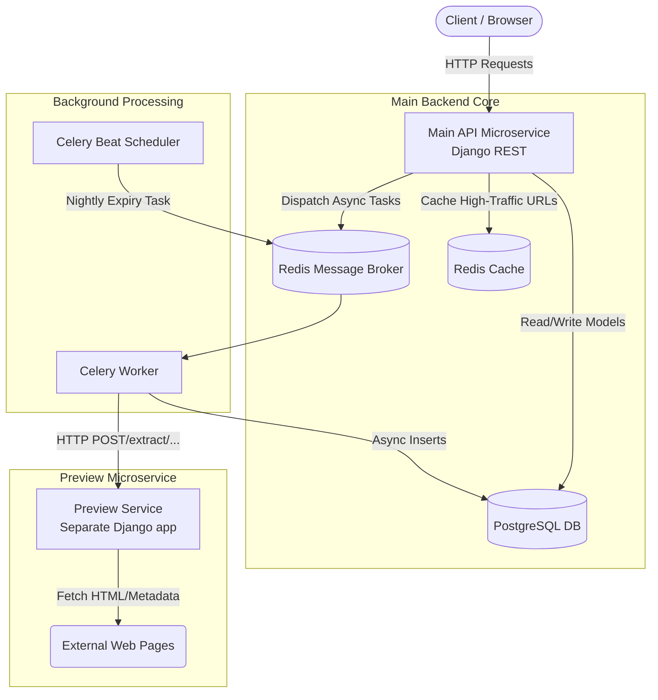

# Enterprise-Grade URL Shortener Microservice

A high-performance, containerized URL Shortener API built with Django REST Framework, PostgreSQL, Redis, and Celery, paired with an independent metadata Preview Microservice. This distributed system offers tiered access control, background metadata scraping, automated expiry, detailed click tracking analytics, and geographic IP resolution.

## 🚀 Features

* **Microservice Architecture**: Decoupled Django main backend handling business logic, with an independent Preview Service microservice handling external metadata extraction.
* **Tiered Access (RBAC)**: Free vs Premium user capabilities (e.g., custom aliases and advanced analytics).
* **Asynchronous Processing**: Celery & Redis handle background metadata scraping from the Preview Service and nightly dead-link archiving.
* **Click Analytics**: Tracks total hits, unique geographical locations, and time-series click arrays for premium users.
* **High-Performance Redirects**: Redirect lookups are cached in Redis to minimize database I/O for high-traffic links.
* **Rate Limiting**: Throttling configured for anonymous users, active users, and brute-force login protection.

---

## 🏗️ Architecture Diagram

The system employs a distributed microservice pattern orchestrated via Docker Compose. The background Celery workers communicate directly with the independent Preview Microservice to extract DOM metadata from destination URLs.



---

## 📂 Complete Folder Structure

```text
module-6-7-8-9/
├── api/                   # Consolidated URL routing for all API endpoints
├── config/                # Core Django project settings & application hub
│   ├── settings/          # Environment-specific settings (base.py, dev.py, prod.py)
│   ├── asgi.py
│   ├── urls.py
│   └── wsgi.py
├── core/                  # Core Models (Custom User, Authentication configuration)
├── services/              # Independent Microservices
│   └── preview/           # The Preview Service microservice (metadata extraction)
│       ├── main.py        # Microservice entrypoint
│       └── Dockerfile     # Isolated microservice container build file
├── shortener/             # Main business logic app (URLs, Clicks, Tags)
│   ├── tasks.py           # Celery asynchronous jobs (track_click, fetch_metadata)
│   ├── views.py           # Endpoint handlers
│   ├── serializers.py     # DRF Data transformation
│   └── tests/             # Comprehensive unit and integration test directory
├── .env                   # Environment variables (DB credentials, secret keys)
├── manage.py              # Django management script
├── requirements.txt       # Python dependencies
├── docker-compose.yml     # Multi-container orchestration (Web, DB, Redis, Celery, Preview)
└── Dockerfile             # Main Django API container build file
```

---

## 🛠️ How to Run the Project (Docker)

The fastest and most reliable way to spin up the entire distributed infrastructure (Main API, Database, Redis, Celery Workers, and the Preview Service) is using Docker Compose.

1. **Clone the repository** and ensure Docker Desktop is running on your machine.
2. **Build and start the services** in detached mode:
   ```bash
   docker compose up -d --build
   ```
3. **Run database migrations** to initialize the PostgreSQL schema for the Main API:
   ```bash
   docker compose exec web python manage.py migrate
   ```
4. **Create a superuser** (optional, for accessing the Django Admin panel):
   ```bash
   docker compose exec web python manage.py createsuperuser
   ```

### Accessing the Interconnected Services

* **Interactive API Documentation (Swagger)**: [http://localhost:8000/api/v1/schema/swagger-ui/](http://localhost:8000/api/v1/schema/swagger-ui/)
* **Django Admin**: [http://localhost:8000/admin/](http://localhost:8000/admin/)
* **Preview Service Docs**: [http://localhost:8001/docs/](http://localhost:8001/docs/)

---

## 🔌 API Endpoint Specifications

All primary endpoints exposed by the Main API sit behind the `/api/v1/` namespace (except the public redirection endpoint).
Authentication is handled via JWT Bearer tokens.

### Authentication

* `POST /api/v1/auth/register/` - Create a new user account.
* `POST /api/v1/auth/login/` - Authenticate and return Access & Refresh JWT tokens.
* `POST /api/v1/auth/refresh/` - Submit a valid refresh token to receive a new Access token.

### URL Operations

* `POST /api/v1/urls/` - Create a short link. Validates tier quotas (Free users: max 10 URLs, no custom aliases).
* `GET /api/v1/urls/` - List all URLs owned by the authenticated user. Supports tag filtering (`?tag=work`).
* `GET /api/v1/urls/{short_code}/` - Retrieve detailed metadata of a specific URL.
* `PUT /api/v1/urls/{short_code}/` - Update the target destination of an existing short code.
* `DELETE /api/v1/urls/{short_code}/` - Hard delete a URL and immediately invalidate its cache.

### Public Interface

* `GET /{short_code}/` - The Redirection Endpoint.
  * *Implementation Note*: Returns an HTTP `302 Found` redirect.
  * Internally triggers a synchronous Redis cache-lookup followed by pushing an asynchronous `track_click_task` to Celery to parse Request headers and update analytics databases.

### Analytics

* `GET /api/v1/urls/analytics/{short_code}/` - Detailed click statistics for one URL.
  * *Free Users*: Returns basic `total_clicks` count.
  * *Premium Users*: Returns complete daily time-series arrays and geographical location breakdowns.

---

## 🧪 Running Tests

The application includes a comprehensive backend testing suite covering Views, Models, and Custom API behavior constraints.

To execute the unit tests inside the running container:

```bash
docker compose exec web python manage.py test shortener
```
