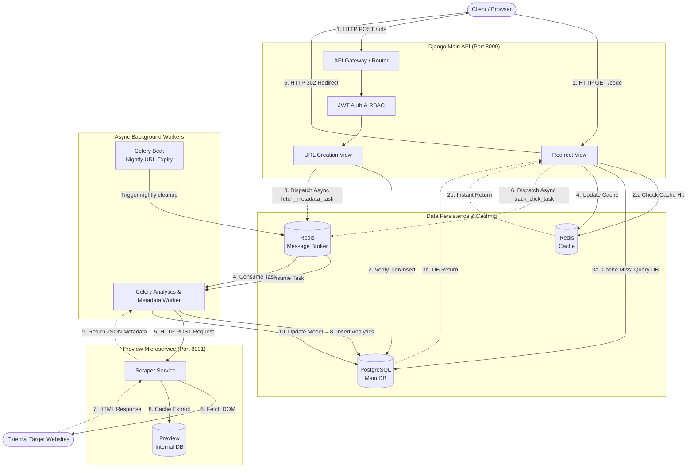

# Comprehensive Guide: Enterprise-Grade URL Shortener Microservice

Welcome to the comprehensive documentation for the Enterprise-Grade URL Shortener. This project simulates a real-world, high-traffic URL shortening application similar to Bitly, complete with caching, background processing, tier-based access control, analytics tracking, and a decoupled microservices architecture.

## 🌟 1. System Overview & Architecture

This application consists of two main services running in a distributed Dockerized environment:
1. **Main API Service (Django REST Framework)**: Handles user authentication, link generation, analytics access, and rate-limiting.
2. **Preview Microservice (Django)**: An independent, isolated service responsible for outbound HTTP requests to fetch metadata (title, description, favicon) from target URLs.

### How the Components Talk to Each Other
- **PostgreSQL**: Used as the primary relational database for the main App and the Preview Service.
- **Redis Cache**: Functions as an in-memory cache to make short-link redirection instant (bypassing the DB).
- **Redis Message Broker & Celery**: Handles long-running or non-blocking tasks. When a user creates a link or clicks one, Celery tasks are fired off to fetch metadata or update click counts asynchronously.

#### Architecture Graph


#### Request Flow Sequence

```mermaid
sequenceDiagram
    participant User as Client Browser
    participant API as Main Django API
    participant Cache as Redis (Cache & Broker)
    participant DB as Main PostgreSQL
    participant Worker as Celery Worker
    participant Preview as Preview Microservice
    participant Ext as Target Website

    %% -- REDIRECTION FLOW --
    rect rgb(30,30,40)
        Note over User, DB: REDIRECTION FLOW (GET /{short_code})
        User->>API: GET /{short_code}
        API->>Cache: 1. Lookup `url:{short_code}`
        alt Cache HIT
            Cache-->>API: Returns target URL
        else Cache MISS
            API->>DB: 2. Query URL Model (Check expiration/activation)
            DB-->>API: URL Details
            API->>Cache: 3. Set `url:{short_code}` (Timeout)
        end
        API-->>User: HTTP 302 Redirect (instant)
        API-->>Cache: 4. Async Dispatch: `track_click_task`(ip, agent)
        Cache-->>Worker: Consume Task
        Worker->>DB: 5. Insert to `Click` Model (Analytics)
    end

    %% -- URL SHORTENING FLOW --
    rect rgb(40,30,30)
        Note over User, Ext: URL CREATION FLOW (POST /api/v1/urls/)
        User->>API: POST /urls/ (with JWT)
        API->>DB: 1. Verify User Tier/Quota
        DB-->>API: Quota OK
        API->>DB: 2. Save URL mapping
        API-->>User: HTTP 201 Created (short_code)
        API-->>Cache: 3. Async Dispatch: `fetch_metadata_task`
        Cache-->>Worker: Consume Task
        Worker->>Preview: 4. HTTP POST /extract (Metadata extraction)
        Preview->>Ext: Fetch DOM (Title, Favicon, Desc)
        Ext-->>Preview: HTML
        Preview-->>Worker: JSON Metadata
        Worker->>DB: 5. Update URL Model with Metadata
    end
```


## 🛠️ 2. Module Implementation Details & Inner Workings

### Module 5: Foundations & Containerization
- **Implementation**: The core system uses Django 5.0+ and DRF. It is fully containerized using a multi-container `docker-compose.yml` that provisions the DB, Redis, Celery Workers, Celery Beat (scheduler), the Main Web API, and the Preview Service.
- **REST API**: Standardized JSON REST API with comprehensive Swagger/OpenAPI documentation via `drf-spectacular`.

### Module 6: Data Schema & ORM Optimizations
- **Custom User Model**: Extended with `is_premium` and `tier` (Free, Premium, Admin) variables to dictate business logic.
- **URL & Click Models**:
  - The `URL` model tracks the relationship between `short_code`, `original_url`, metadata, and the `owner` (ForeignKey). It features an aggregated `click_count` for rapid read access.
  - The `Click` model logs every exact hit (IP address, origin country, User-Agent header) mapped back to the URL.
- **Query Optimization**: Django ORM's `select_related` and `prefetch_related` are used to prevent N+1 query problems when fetching user links alongside tags or analytics.

### Module 7: Authentication & Tiered Access Control (RBAC)
- **JWT Authentication**: Secured using `djangorestframework-simplejwt`. Users obtain stateless access and refresh tokens.
- **Tier Restrictions**:
  - **Free Tier**: Limited to generating up to 10 URLs. Generates random 6-character alphanumeric aliases. Receives basic metric access.
  - **Premium Tier**: Unlocked quota. Allows specifying vanity/custom aliases (e.g., `bit.ly/my-brand`). Gains access to time-series analytics and geographic location tracking data.
- **Security**: The application applies API throttling and custom permission classes (`IsOwnerOrReadOnly`) preventing horizontal privilege escalation.

### Module 8: Asynchronous Processing & Redis Caching
*This module ensures our API does not bottleneck under heavy loads.*
- **The Redirect Flow (Cache-Aside pattern)**:
  When a user visits `http://localhost:8000/<short_code>`:
  1. The API checks **Redis** for the target URL. If found, it returns an HTTP 302 redirect instantly.
  2. If missing, it queries PostgreSQL, validates expiration dates, caches the target URL in Redis, and then redirects.
- **The "Write-Behind" Analytics**:
  We do *not* write to the `Click` database during the redirect request (which would block the user). Instead, we trigger `track_click_task.delay(ip, user_agent)`, delegating the IP geographic resolution and DB insert to a Celery Worker in the background.

### Module 9: Decoupled Microservices
- **Preview Service Integration**: When a URL is shortened, the main app dispatches `fetch_and_save_metadata_task`. This Celery worker performs an HTTP call to the internal `preview-service` microservice on port `8001`. The preview service scrapes the target website for its `<title>`, `<meta description>`, and favicon, returning it to the main app to update the `URL` model.

---

## 🏃 3. Getting Started (Deployment)

Because the system is distributed, it relies purely on Docker Compose to initialize the environment reproducibly.

### Prerequisites
- Docker & Docker Compose installed.

### Setup Steps
1. **Boot all services in the background**:
   ```bash
   docker compose up -d --build
   ```
2. **Apply Database Migrations** (for both relational databases):
   ```bash
   docker compose exec web python manage.py migrate
   docker compose exec preview-service python manage.py migrate
   ```
3. **Create a Superuser** (to explore the Django Admin):
   ```bash
   docker compose exec web python manage.py createsuperuser
   ```

### Service Access URLs
- **Main API Swagger Documentation**: `http://localhost:8000/api/v1/schema/swagger-ui/`
- **Main Django Admin**: `http://localhost:8000/admin/`
- **Preview Microservice**: `http://localhost:8001/docs/`

---

## 🔌 4. Core API Workflows

### 4.1. Account & Authentication
- `POST /api/v1/auth/register/` - Create a new User.
- `POST /api/v1/auth/login/` - Procure access and refresh tokens.

### 4.2. URL Management
Requires `Authorization: Bearer <Your_Token>`.
- `POST /api/v1/urls/`
  - Body: `{"original_url": "https://example.com"}`
  - Modifiers: Premium users can inject `"custom_alias": "my-site"`.
- `GET /api/v1/urls/` - Fetch all your generated short links.
- `PUT /api/v1/urls/{short_code}/` - Update target URL (triggers cache invalidation and async metadata re-fetch).
- `DELETE /api/v1/urls/{short_code}/` - Deactivate & delete links.

### 4.3. Link Redirection
- `GET /{short_code}/`
  - Public facing endpoint. Resolves the short code to the long URL via Redis cache, returns a 302 Redirect, and silently tracks the click asynchronously in Celery.

### 4.4. Analytics Dashboard
- `GET /api/v1/urls/analytics/{short_code}/`
  - Returns analytics payloads based on the user's tier.
  - Free users receive total `click_count`.
  - Premium users get an enriched JSON payload with nested `time_series` daily arrays and geographic `locations` distribution.

---

## 🧪 5. Testing
The application employs rigorous test suites encompassing models, views, and tier-constraint limits.
To execute unit tests within the docker container:
```bash
docker compose exec web python manage.py test shortener
```
